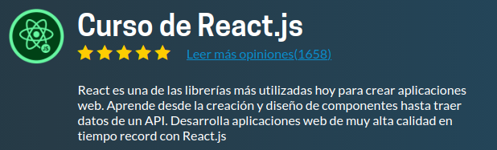
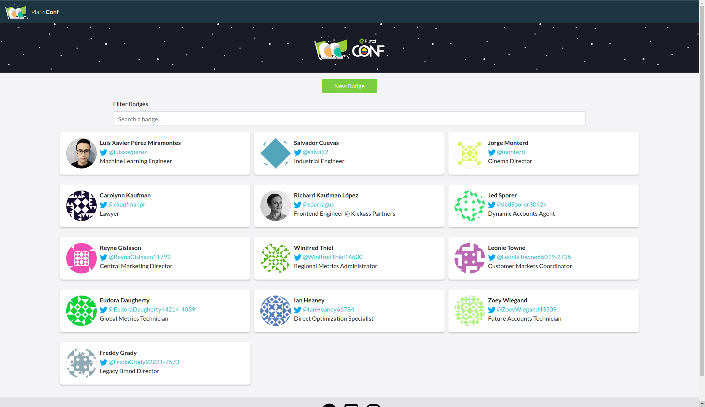

# Platzi-badges
This is a ReactJs project from the "course of ReactJS" at Platzi.

  

## Description
This project consists on develop a platform where the admin can keep a register of the Platzi Conf attendants. Every registered user can modify their personal information. Each one of them will have a badge where it will be show their name, image, job title and twitter.
In this platform you can also list all the attendants and filter them by name.

  

  

  

  

## Things Learned
- React Fundamentals.
- Creation and Design of components.
- React Router.
- Requests to APIs.
- React Hooks.
